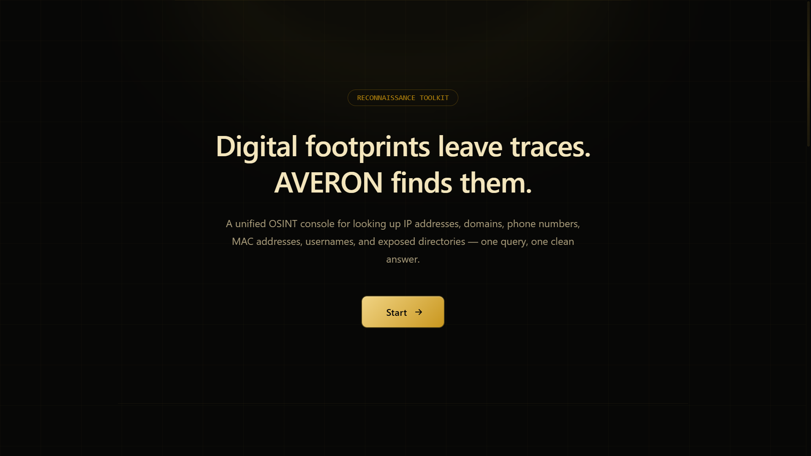

[](https://git.io/typing-svg)

# AVERON

OSINT lookup framework built with Django, Python, JavaScript, public REST APIs, and Python libraries. Web-based black and gold UI with IP, phone, domain, MAC, username, and directory lookup.

For educational purposes and responsible OSINT research only. Author not responsible for misuse.

## Installation & Run

1. Download the project and open the folder in terminal.
2. Install dependencies:

```bash
pip install -r requirements.txt
````

3. Start the server:

```bash
python manage.py runserver
```

4. Open `http://127.0.0.1:8000` in your browser.

## Alternative Quick Launch

You can also start the project using the launcher script:

```bash
python launch.py
```

The launcher will:

* Install all dependencies from `requirements.txt`
* Start the Django development server
* Automatically open the web interface in your default browser

This is the recommended option for users who want a quick startup experience.

## How To Use

Select a module and enter the required value.

* **IP Lookup** - Geolocation, ISP, and organization behind an IPv4 address.
* **Phone Lookup** - Carrier, region, and line type behind a phone number.
* **Domain Lookup** - Hosting information and resolved IP for a domain.
* **MAC Lookup** - Hardware vendor tied to a MAC address.
* **Username Search** - Check supported platforms for a given username.
* **Directory Lookup** - Search supported public directory sources.

AVERON sends the request to the corresponding public source and displays the returned information in the interface.

## About

AVERON puts common OSINT lookups into one place instead of using multiple websites for different types of information.

Django handles the requests server-side, while the lookup modules use public APIs and Python libraries to retrieve and process the results.

There is no local OSINT database and lookup results are not cached between requests.

## requirements.txt

```text
django~=5.0.0
requests
phonenumbers
aiohttp
```

## Limitations

Every result comes from an external public source, so accuracy, completeness, uptime, and rate limits depend on that source.

Treat results as a starting point for research, not as a verified record.

## Responsible Use

AVERON is intended for educational OSINT research, security research, checking your own public exposure, and authorized investigations.

Do not use AVERON for stalking, harassment, doxxing, or targeting people without a legitimate reason.

## Preview

<p align="center">
  
</p>

**AVERON** - OSINT Research Framework
